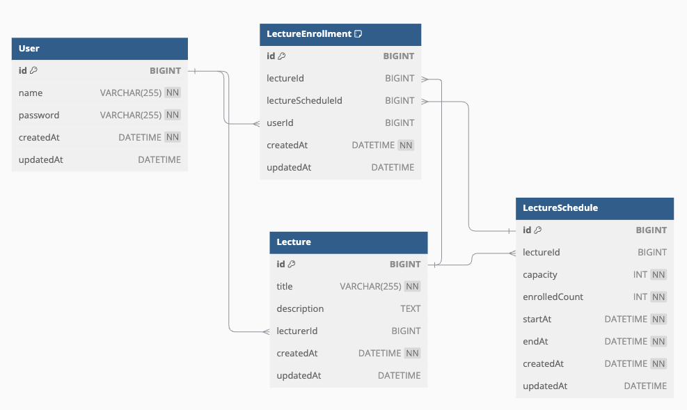

# DB ERD

요구 사항 분석 결과 사용자, 특강, 특강 날짜, 특강 신청 정보를 저장해야 한다.

각 테이블의 필드와 관계는 다음과 같다.
클린 아키텍처 과제 프로젝트이기에 별도의 길이 제한은 하지 않았다.

## User (UserEntity)

사용자 정보를 저장하는 테이블이다.

- id (BIGINT): 사용자의 고유 식별자 (Primary Key, Auto Increment)
- name (VARCHAR(255)): 사용자 이름
- password (VARCHAR(255)): 사용자 비밀번호
- createdAt (DATETIME): 생성 시간
- updatedAt (DATETIME): 수정 시간

유니크 제약조건:

- name: 사용자 이름은 중복될 수 없다.

요구사항에 사용자가 있으나 회원가입/로그인 기능은 미구현이므로 사용자 정보만 저장한다.

## Lecture (LectureEntity)

특강 정보를 저장하는 테이블이다.

- id (BIGINT): 특강의 고유 식별자 (Primary Key, Auto Increment)
- title (VARCHAR(255)): 특강 제목
- description (TEXT): 특강 설명
- lecturerId (BIGINT): 강연자 ID (User 테이블의 id를 참조)
- createdAt (DATETIME): 생성 시간
- updatedAt (DATETIME): 수정 시간

## LectureSchedule (LectureScheduleEntity)

특강 날짜 정보를 저장하는 테이블이다.

- id (BIGINT): 특강 일정의 고유 식별자 (Primary Key, Auto Increment)
- lectureId (BIGINT): 특강 ID (Lecture 테이블의 id를 참조)
- capacity (INT): 특강 수용 인원
- enrolledCount (INT): 현재 등록된 인원 수
- startAt (DATETIME): 특강 시작 시간
- endAt (DATETIME): 특강 종료 시간
- createdAt (DATETIME): 생성 시간
- updatedAt (DATETIME): 수정 시간

특강은 날짜별로 여러개가 있을 수 있으므로 특강 날짜 정보를 저장한다.

## LectureEnrollment (LectureEnrollmentEntity)

특강 신청 정보를 저장하는 테이블이다.

- id (BIGINT): 특강 등록의 고유 식별자 (Primary Key, Auto Increment)
- lectureId (BIGINT): 특강 ID (Lecture 테이블의 id를 참조)
- lectureScheduleId (BIGINT): 특강 일정 ID (LectureSchedule 테이블의 id를 참조)
- userId (BIGINT): 사용자 ID (User 테이블의 id를 참조)
- createdAt (DATETIME): 생성 시간
- updatedAt (DATETIME): 수정 시간

복합 유니크 제약조건:

- (userId, lectureScheduleId): 한 사용자가 같은 특강 일정에 중복 등록할 수 없다.

특강 신청 API 구현 시 사용자가 동일 강의에 한 번만 신청 가능하도록 중복 신청을 방지하기 위해 사용한다.

## 설계 이유

1. User 테이블 분리:
    - 사용자 정보를 별도 테이블로 관리해 향후 회원 기능 확장에 대비
    - 사용자 이름에 유니크 제약조건을 걸어 중복 방지

2. Lecture와 LectureSchedule 분리:
    - 하나의 특강이 여러 날짜에 걸쳐 진행될 수 있음을 고려
    - 동일한 특강을 여러 시간대에 개설 가능

3. LectureSchedule의 capacity와 enrolledCount:
    - 각 일정별 수용 인원과 현재 등록 인원 관리로 중복 등록 방지 및 남은 자리 계산 용이

4. LectureEnrollment 테이블:
    - 사용자의 특강 신청 이력 관리 및 중복 신청 방지
    - lectureId와 lectureScheduleId 저장으로 사용자의 특정 특강 및 일정 등록 정확히 추적
    - userId와 lectureScheduleId의 조합에 복합 유니크 제약조건을 걸어 중복 등록 방지

5. Entity와 Domain 객체의 분리:
    - 각 엔티티 클래스의 toXXX() 메서드로 영속성 계층과 도메인 계층 분리
    - 클린 아키텍처 원칙을 따르며, 각 계층의 독립성 보장

6. 유니크 키와 복합키 사용:
    - 데이터 무결성 보장
    - 중복 데이터 방지
    - 조회 성능 향상

이 설계는 확장성, 유지보수성, 데이터 무결성을 고려한 결과다. 특강 시스템의 요구사항을 충족하면서 향후 기능 확장에 대비할 수 있는 구조를 갖추고 있다.